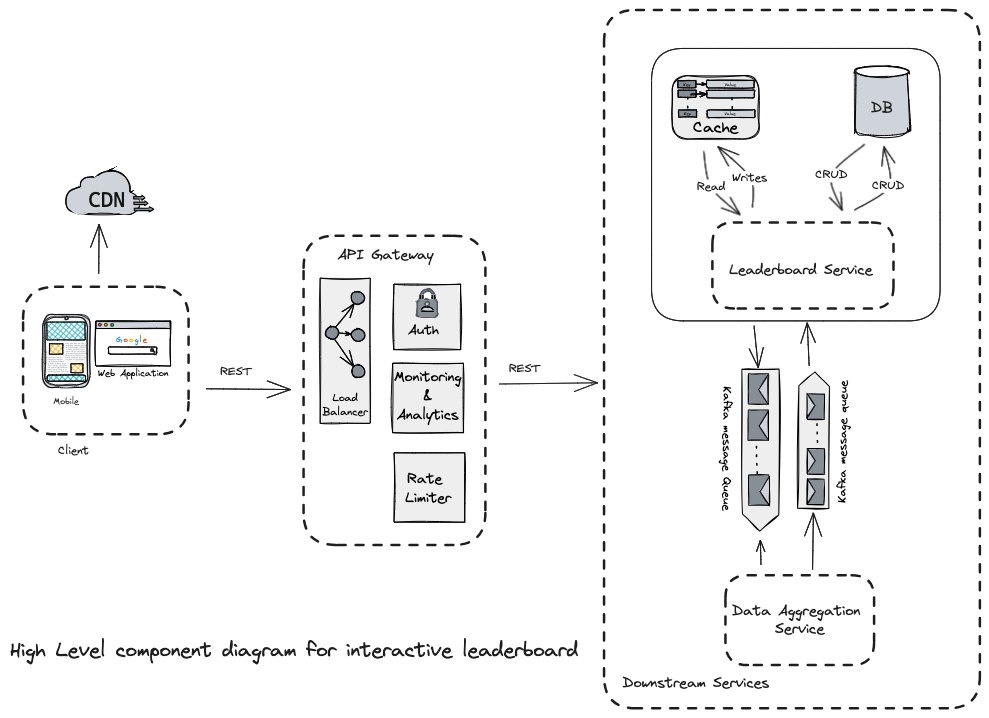
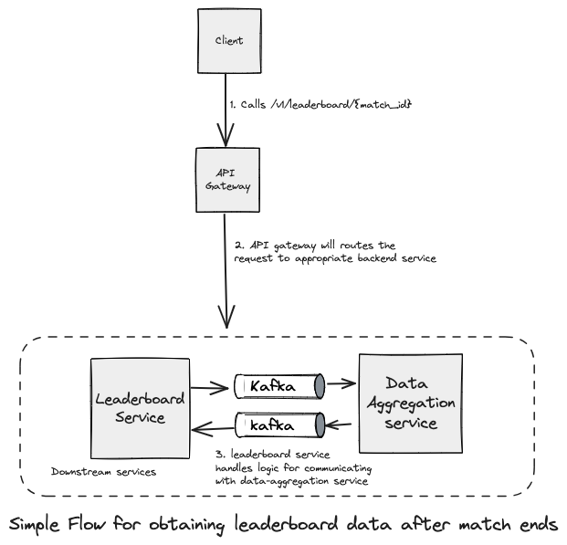

# Leaderboard System Design for Epic Games Assessment

## Problem Statement

Design an interactive web-based client leaderboard for one of Epic's multiplayer online games.

### Functional Requirements

- Leaderboard should be based on eliminations across all games played by user.
- The client can view user-facing dashboard after every match.
- Leaderboard should support multiple game modes (4 in total), time-based aggregation (daily, weekly & all-time) and user driven filtering capabilities (i.e. friends, groups, recently played etc).
- Leaderboard should support 10 million concurrent players with average of 10,000 game matches every minute.

### Non Functional Requirements

- High availability
- Low Latency
- Reliability
- Scalability
- Resilience
- Minimal operational overhead

### Component Diagram



### Leaderboard API Design

The downstream leaderboard services will expose the RESTful API's over HTTPS
protocol. At high level, we need API's that can provide leaderboard data per game, can support filtering and aggregation.

#### GET /v1/leaderboard/{match_id}

This end-point will fetch the leaderboard data for current match id which will be used to get details after match ends.

```javascript
/v1/leaderboard/:match_id
method: GET
authorization: Bearer <JWT>
accept: application/json, text/html
```

Params
| Params Field | Description |
| ------- | --- |
| match_id | The match id of the game (UUID)|

Sample Response

```javascript
{
    player_info: [
        {
            player_id: "player-1-uuid",
            player_name: "player-1",
            elimination_score: 100,
            rank: 1,
            created_at: "2024-06-19T22:36:07Z",
            updated_at: "2024-06-19T22:36:07Z"
        }
        {
            ......
        }
    ]
    page_size: 10,
    page: 1,
    total: 100
}
```

#### GET /v1/leaderboard/user/{user_id}

This end-point will fetch the leaderboard data for user with particular user id, this is useful for viewing leaderboard data for a particular player also support optional filter params for further filtering data by game modes and such.

```javascript
/v1/leaderboard/user/:user_id
method: GET
authorization: Bearer <JWT>
accept: application/json, text/html
```

Params
| Params Field | Description |
| ------- | --- |
| user_id | The user id of the player (UUID)|

Sample Response

```javascript
{
    player_info: {
        id: "player-1-uuid",
        player_name: "player-1",
        elimination_score: 100,
        current_rank: 123,
        created_at: "2024-06-19T22:36:07Z",
        updated_at: "2024-06-19T22:36:07Z"
        profile: {
            url_media: "some-url"
        }
        ....
    }
}
```

#### GET /v1/leaderboard

This endpoint used to get the leaderboard based on query params, the supported params explained down below. This end point will support filtering, getting leaderboard data for different game modes as well aggregation data for weekly, daily and all-time stats. This API will also support pagination, sorting will help us in designing better user-experience and performance, flexibility and scaling as needed.

```javascript
/v1/leaderboard
method: GET
authorization: Bearer <JWT>
accept: application/json, text/html
```

Query Params
| Params | Description |
| ------------- | ------------- |
| game_mode| Game mode type |
| time_filter | Aggregation time filter (Daily, Weekly and All-time) |
| user_filter | Filter param used for user-filtering by friends, group, sorting, ranks etc.|

Sample Response

```javascript
{
  {
    game_mode: "SOLO",
    player_ranking: [
        {
            player_id: "player-1-uuid",
            player_name: "player-1",
            elimination_score: 100,
            rank: 1,
            created_at: "2024-06-19T22:36:07Z",
            updated_at: "2024-06-19T22:36:07Z"
        }
        {
            ......
        }
    ]
    page_size: 10,
    page: 1,
    total: 100
}
}
```

### Tech Stack (Can be easily interchangeable with different tech and tools)

- Frontend - Next.js with TypeScript and React
- Backend - Node.js with Express
- Database - NoSQL DynamoDB
- Data Aggregator Service - Elastic (or similar)
- Cache - Redis
- Queue/Event Streaming - Kafka
- Deployments - Kubernetes/Docker
- Cloud Infrastructure - AWS
- Monitoring Tools - Datadog
- Analytics - Pendo/Google

### High-Level Architecture (Overview)



A simple high-level design is shown in the above diagram for obtaining leaderboard data for a single game. Here is a brief overview of the flow process:

1. When a player either wins or loses, or a match ends, the client sends a request to the leaderboard service to obtain data for constructing the user-facing leaderboard on the client side.
2. The leaderboard service, which handles the logic for updating the elimination scores, exposes a fetch endpoint. This endpoint is called through the API Gateway to obtain the corresponding leaderboard stats after the game ends.
3. The leaderboard service communicates with the data-aggregator service via a message queue. The data-aggregator service is responsible for complex aggregation logic, reducing the load on the leaderboard service by handling the aggregation tasks separately.
4. A player can directly call the leaderboard service to retrieve leaderboard data, including:
   1. Viewing global leaderboard rankings (Top 10's or Top 100's)
   2. Viewing party/friends leaderboard
   3. Viewing different leaderboard data by game modes
   4. Viewing weekly, daily, or all-time leaderboard data

### Design Deep Dive

In this section, I will discuss three main components of our design: the client web application, the API gateway, and the backend logic. I will also touch on assumptions and trade-offs made during the design process.

#### 1. Client Web Application

The client web application is built using Next.js, TypeScript, React. This stack was chosen for the following reasons:

- **Next.js:**
  - **Server-Side Rendering (SSR) and Static Site Generation (SSG):** Improves performance, SEO, and initial load times.
  - **Built-in API Routes:** Simplifies backend integration.
- **TypeScript:**
  - **Type Safety:** Reduces runtime errors by catching issues at compile-time.
  - **Enhanced Tooling:** Provides better developer experience with auto-completion and refactoring capabilities.
- **React:**
  - **Component-Based Architecture:** Allows for reusable, testable, and maintainable UI components.
  - **Large Ecosystem:** Facilitates rapid development with a wide array of libraries and tools.

The web client communicates with the API gateway via HTTPS to fetch leaderboard data. It displays various leaderboard views, including global rankings, party/friends rankings, different game modes, and time-based leaderboards (daily, weekly, all-time).

#### 2. API Gateway

The API gateway is a crucial component that routes requests from the client web application to the appropriate backend services. It provides:

- **Routing:** Directs incoming requests to the correct service endpoints.
- **Authentication and Authorization:** Ensures secure access to the backend services.
- **Rate Limiting:** Protects the backend services from abuse and ensures fair usage.
- **Load Balancing:** Distributes incoming requests evenly across multiple instances of the backend services to ensure high availability and performance.
- **Monitoring and Analytics:** Integrates with monitoring tools like Datadog to track API performance, response times, error rates, and other critical metrics. This helps in identifying and resolving issues quickly and ensures the service runs smoothly.

The API gateway processes the following key endpoints:

- **GET /leaderboard/{match_id}:** Fetches leaderboard data for a game.
- **GET GET leaderboard/user/{user_id}:** Fetches leaderboard data for a user.
- **GET /leaderboard:** Fetches leaderboard data, accepts query parameters to filter and aggregate the results, and supports user-based filtering.

#### 3. Backend Logic

Assuming the backend service will handle the logic for collecting information about elimination score, but I have provided a simple overview how the service will work

- **Leaderboard Service:**

  - Handles requests from the API gateway to fetch leaderboard data.
  - Updates elimination scores and retrieves the latest leaderboard stats.
  - Communicates with Redis for quick data retrieval and with DynamoDB for persistent storage.

- **Data Aggregator Service:**

  - Responsible for performing complex data aggregation tasks.
  - Communicates with the Leaderboard Service via Kafka to offload aggregation logic.
  - Ensures that the Leaderboard Service can efficiently handle read-heavy operations without being bogged down by complex aggregations.

- **DynamoDB:**

  - NoSQL database used for storing raw and aggregated leaderboard data.
  - Provides high throughput and low latency, essential for handling large volumes of read/write operations.
  - Properly partitioned to handle large data volumes and prevent hot partitions.

- **Redis:**

  - In-memory data store used for caching frequently accessed leaderboard data.
  - Reduces load on DynamoDB and provides faster data retrieval times.

- **Kafka:**
  - Message queue used for event streaming and reliable message processing.
  - Decouples the Leaderboard Service from the Data Aggregator Service, ensuring that the system remains responsive under high load.

### Assumptions and Trade-Offs

- **Assumptions:**

  - The web client should be able to support 10 millions concurrent player which includes handling high volumes of traffic, ensuring frontend remain responsive under heavy loads.
  - The backend game servers reliably send elimination data to Kafka to ensure reliable data ingestion by data-aggregator service.
  - DynamoDB can handle the expected read/write throughput with proper partitioning and indexing.
  - Redis effectively caches leaderboard data, reducing the load on DynamoDB.

- **Trade-Offs:**
  - **Caching:** While Redis significantly improves read performance, it introduces complexity in cache invalidation and synchronization with DynamoDB.
  - **Eventual Consistency:** Using DynamoDB with eventual consistency for reads may result in slight delays in data visibility, which is a trade-off for improved performance and scalability.
  - **Complex Aggregation Logic:** Offloading aggregation to a separate service (Data Aggregator Service) simplifies the Leaderboard Service but adds complexity in managing inter-service communication and data consistency.

### Ensuring Durability and Scalability

To ensure our leaderboard system can handle 10,000 matches per minute and 10 million concurrent players, and can scale 10x, we need to implement a robust and scalable architecture. Here’s how we can achieve this:

#### 1. Scaling and Durability

1. **CDN for Frontend Assets:**

   - **Geographical Distribution:** Using a CDN ensures that static assets (images, CSS, JavaScript files) are cached and served from edge locations closest to users. This reduces latency and improves load times, making the web application scalable for a global audience.

2. **Kubernetes for Autoscaling:**

   - **Auto-Scaling:** Kubernetes can automatically scale up or down the number of pods based on the load. This ensures that the system can handle spikes in traffic and maintain performance.
   - **Load Balancing:** Kubernetes can distribute traffic evenly across all instances, preventing any single instance from becoming a bottleneck.

3. **Partitioning Databases:**

   - **Based on Game Modes or Keys:** Partitioning DynamoDB tables based on game modes or other logical keys can distribute the load more evenly and improve read/write throughput. This prevents any single partition from becoming a hotspot.

4. **Load Balancer:**

   - **Distribute Requests Evenly:** Using load balancers ensures that incoming requests are evenly distributed across multiple instances of the API Gateway and backend services. This prevents any single instance from becoming a bottleneck.
   - **Multiple Instances of API Gateway:** Deploying multiple instances of the API Gateway ensures high availability and reliability.

5. **Weighted Routes:**
   - **Resource Allocation:** Implementing weighted routing can prioritize routes that are read-heavy, ensuring they get more resources. This helps in managing traffic efficiently and improving performance for critical operations.

#### 2. Reliability

1. **Redundancy:**

   - **Multiple Clusters:** Deploying multiple clusters in different regions ensures high availability and fault tolerance. This avoids single points of failure (SPOF).
   - **Database Replication:** Using DynamoDB’s replication mechanism ensures that data is replicated across multiple regions, providing high availability and disaster recovery.

2. **Failover Mechanism:**
   - **Caching:** Redis can serve as a failover mechanism, providing stale data if the database is overloaded or unavailable.
   - **Database Failover:** Implementing automatic failover for DynamoDB ensures that another replica can take over in case of failure.

#### 3. Resilience

1. **Queue or Event Streaming:**

   - **Decoupling Services:** Using Kafka for event streaming ensures that data ingestion is decoupled from processing. This prevents the database from being overwhelmed by a sudden influx of data.

2. **Serve Stale Data from Cache:**

   - **Cache Fallback:** In case DynamoDB is overloaded, Redis can serve stale data to ensure that the system remains responsive. This provides a graceful degradation of service.

3. **Circuit Breakers:**
   - **Preventing Cascading Failures:** Implementing circuit breakers in the API Gateway and backend services prevents cascading failures by stopping requests to unhealthy services. This ensures that a failure in one part of the system does not affect the entire system.

#### 4. Metrics Collection

1. **Monitoring and Logging:**
   - **API Request and Response Time:** Monitoring API request and response times helps in identifying performance bottlenecks and optimizing them.
   - **Cache Hit and Miss Rates:** Tracking cache performance ensures efficient data retrieval and identifies areas for optimization.
   - **Database Query Performance:** Monitoring DynamoDB query performance helps in optimizing indexing and query patterns.
   - **Queue Processing Time:** Tracking Kafka processing times ensures that data is being processed efficiently.
   - **Error Rates and Success Rates:** Monitoring error and success rates helps in identifying and resolving issues promptly.
   - **Read-Write Ratio:** Tracking the read-write ratio helps in understanding the workload and optimizing resource allocation.
   - **Peak Load Metrics:** Monitoring peak load metrics helps in planning capacity and ensuring the system can handle traffic spikes.
   - **Service Recovery Report:** Collecting data on service recovery times helps in improving disaster recovery plans.

#### 5. Bottlenecks and Mitigation

1. **Database Write Throughput:**

   - **Batching and Async Writes:** Using batching and asynchronous writes can prevent overloading the database and improve write throughput.

2. **Caching Strategies:**

   - **Efficient Cache Invalidation:** Implementing efficient cache invalidation strategies ensures that the cache remains up-to-date with minimal overhead.

3. **API Rate Limiting:**
   - **Preventing DDOS and Fair Usage:** Implementing API rate limiting ensures that no single user can overwhelm the system, preventing DDOS attacks and ensuring fair usage.

By implementing these strategies, we can ensure that our leaderboard system is durable, scalable, and resilient, capable of handling 10,000 matches per minute and 10 million concurrent players, with the ability to scale 10x as needed.

### Conclusion

The proposed leaderboard system design effectively meets the requirements of handling up to 10 million concurrent players and processing 10,000 game matches per minute. Utilizing technologies such as Next.js, TypeScript, React, Node.js with Express, DynamoDB, Redis, Kafka, and Kubernetes ensures high scalability, reliability, and performance. Key components like the API Gateway, Data Aggregator Service, and caching mechanisms enhance the system's efficiency and responsiveness. By implementing redundancy, auto-scaling, and comprehensive monitoring, the design ensures durability and resilience, making it a robust solution for Epic Games' multiplayer online game leaderboards.
